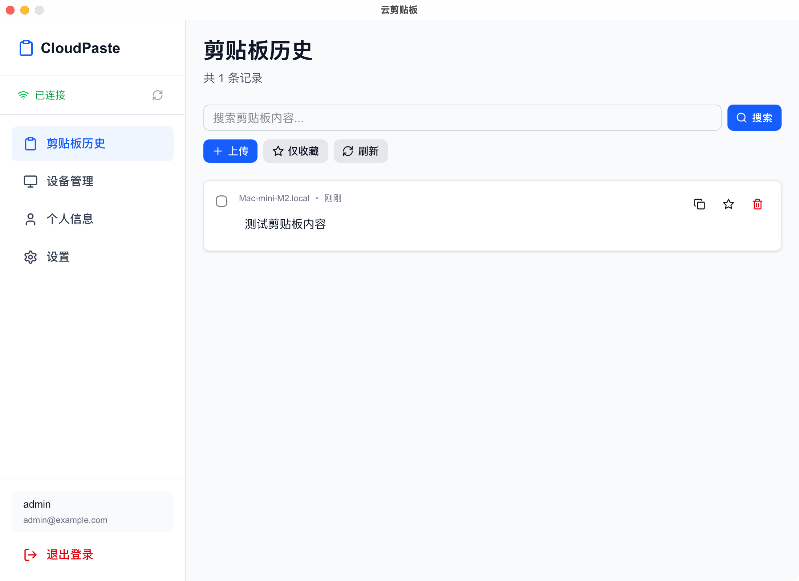

# CloudPaste - 云剪贴板

<div align="center">

[English](./README.en.md) | 简体中文

一款强大的跨平台剪贴板同步工具，让你的复制内容在多个设备间无缝流转。

**自建服务 • 数据自主 • 安全可控**

[特性](#-核心特性) • [使用场景](#-使用场景) • [快速开始](#-快速开始) • [平台支持](#-平台支持)

</div>

---

> 
> **这是一个自建服务应用！**
>
> CloudPaste 需要你自己部署后端服务（支持 Docker 一键部署）。
>
> - 📦 Docker 镜像：`ghcr.io/mrtian2016/cloudpaste:latest`
> - 🔧 基于 FastAPI + WebSocket
> - 💾 数据存储在你自己的服务器上
>
> [👉 查看快速部署指南](#-快速开始)

---

## 🔐 为什么选择自建？

CloudPaste 采用**自建后端服务**的架构设计，而非传统的云服务模式：

- **🔒 数据隐私** - 所有剪贴板数据存储在你自己的服务器上，完全掌控
- **🚀 性能可控** - 无需担心第三方服务限速或不稳定
- **💰 成本透明** - 使用自己的服务器，无需支付订阅费用
- **🛠️ 完全定制** - 可以根据需求修改和扩展功能
- **🌍 内网部署** - 支持部署在内网环境，无需公网访问

### 工作原理

```
┌─────────────┐                  ┌─────────────────┐                  ┌─────────────┐
│  桌面端/Web  │ ◄──WebSocket──► │  你的后端服务器  │ ◄──WebSocket──► │  桌面端/Web  │
│  (设备 A)   │                  │   (自建部署)    │                  │  (设备 B)   │
└─────────────┘                  └─────────────────┘                  └─────────────┘
      ▲                                   │                                   ▲
      │                                   │ 存储                               │
      └───────────────── 实时同步 ────────┼──────────── 实时同步 ─────────────┘
                                          ▼
                                   ┌──────────┐
                                   │  SQLite  │
                                   │  数据库   │
                                   └──────────┘
```

后端服务通过 **WebSocket** 实现实时双向通信，当任一设备复制内容时，立即推送到所有在线设备。

---

## 📸 应用预览

<div align="center">



*桌面端应用 - 简洁直观的剪贴板历史管理界面*

</div>

---

## ✨ 核心特性

### 📋 多格式内容支持

- **文本内容** - 支持纯文本、代码片段、HTML 内容等多种文本格式
- **图片文件** - PNG、JPG、GIF 等常见图片格式的云端存储和同步
- **各类文件** - 支持上传和同步任意类型的文件（文档、音视频、压缩包等）
- **智能预览** - 自动识别内容类型，提供最佳预览体验

### 🔄 实时同步

- **即时推送** - 使用 WebSocket 技术，复制内容立即同步到所有设备
- **多设备在线** - 实时显示设备在线状态，选择性同步到指定设备
- **历史记录** - 所有剪贴板内容自动保存，随时查看和恢复
- **冲突处理** - 智能处理多设备同时操作的情况

### 🔍 强大搜索

- **全文搜索** - 快速搜索历史剪贴板内容
- **类型筛选** - 按文本、图片、文件类型过滤
- **设备筛选** - 查看特定设备的复制记录
- **收藏功能** - 标记重要内容，支持仅显示收藏项

### 💻 跨平台体验

- **桌面端应用** - 基于 Tauri 打造的轻量级原生应用
  - 系统托盘常驻，快捷访问
  - 自动监听系统剪贴板
  - 原生文件操作支持
  - 开机自启动（可选）
  - 应用内自动更新

- **Web 网页版** - 无需安装，浏览器即可使用
  - 响应式设计，适配各种屏幕
  - 支持移动端访问
  - PWA 支持（渐进式 Web 应用）

### 🎨 现代化界面

- **深色模式** - 自动适配系统主题
- **直观交互** - 简洁清晰的操作界面
- **快捷操作** - 一键复制、收藏、删除
- **批量管理** - 支持多选和批量删除
- **内容预览** - 点击即可预览完整内容
  - 图片预览（支持缩放）
  - 代码高亮显示
  - 音视频播放
  - 文本文件查看器

### 🔒 安全可靠

- **用户认证** - 登录后才能访问数据
- **设备管理** - 查看和管理所有已登录设备
- **数据隔离** - 每个用户的数据完全独立
- **配额管理** - 可设置历史记录保存上限

### ⚡ 便捷功能

- **智能识别** - 自动识别代码片段并格式化显示
- **一键下载** - 快速下载图片和文件到本地
- **标签管理** - 为剪贴板内容添加标签分类
- **分页浏览** - 高效加载大量历史记录
- **设备信息** - 显示每条记录的来源设备和时间

---

## 🎯 使用场景

### 👨‍💻 开发者

- 在手机上看到代码片段，复制后立即在电脑 IDE 中使用
- 跨设备调试时快速传递 API Token、URL 等信息
- 保存常用的代码模板和配置片段

### ✍️ 内容创作者

- 在多个设备间同步文案、创意想法
- 收集和整理各种素材链接
- 快速分享图片和媒体文件

### 📱 日常使用

- 手机上复制的地址，电脑上直接使用
- 临时文件跨设备传输
- 重要信息云端备份

### 👥 团队协作

- 快速分享临时信息给团队成员
- 统一管理团队常用的文本模板
- 跨设备协同工作

---

## 🚀 快速开始

> **重要说明**：CloudPaste 是一个需要自建后端服务的应用。你需要先部署后端服务，然后客户端（桌面应用或 Web 版）连接到你的服务器。这样可以确保你的剪贴板数据完全由自己掌控，更加安全可靠。

### 第一步：部署后端服务

后端服务基于 FastAPI + WebSocket，提供实时同步能力。

#### 方式一：使用 Docker 部署（推荐）

这是最简单快速的部署方式：

```bash
# 拉取镜像并运行
docker run -d \
  --name cloudpaste \
  --restart unless-stopped \
  -p 5280:5280 \
  -v ./data:/cloudpaste \
  ghcr.io/mrtian2016/cloudpaste:latest
```

**参数说明：**
- `-p 5280:5280` - 映射端口（默认端口 5280，可以改成你需要的，如 `-p 8000:5280`）
- `-v ./data:/cloudpaste` - 持久化所有数据（数据库 + 上传文件）到当前目录的 data 文件夹
- `--restart unless-stopped` - 容器自动重启

**自定义端口示例：**
```bash
# 使用 8000 端口
docker run -d \
  --name cloudpaste \
  --restart unless-stopped \
  -p 8000:5280 \
  -v ./data:/cloudpaste \
  ghcr.io/mrtian2016/cloudpaste:latest
```

启动后访问 `http://your-server-ip:5280/docs` 查看 API 文档，确认服务正常运行。

#### 方式二：Docker Compose 部署

创建 `docker-compose.yml`：

```yaml
version: '3.8'

services:
  cloudpaste:
    image: ghcr.io/mrtian2016/cloudpaste:latest
    container_name: cloudpaste
    restart: unless-stopped

    # 只需要映射一个目录！
    volumes:
      - ./data:/cloudpaste

    # 暴露端口
    ports:
      - "5280:5280"
```

启动服务：

```bash
docker-compose up -d
```

查看日志：

```bash
docker-compose logs -f
```

停止服务：

```bash
docker-compose down
```

### 第二步：使用客户端

#### 方式一：下载桌面应用（推荐）

1. 前往 [Releases](../../releases) 下载对应平台的安装包
2. 安装并启动应用
3. **首次使用**：在登录页面配置你的服务器地址（如 `http://your-server-ip:5280`）
4. 注册/登录账号
5. 开始使用！应用会自动监听系统剪贴板并同步

#### 方式二：使用 Web 版

1. 部署前端到你的服务器或使用本地开发
2. 访问 Web 地址
3. **首次使用**：配置服务器地址（如 `http://your-server-ip:5280`）
4. 注册/登录账号
5. 开始使用

### 开发者部署

<details>
<summary>点击展开详细部署步骤</summary>

#### 环境要求

- **后端**: Python 3.12+
- **前端**: Node.js 18+
- **桌面端**: Rust (cargo)
- **包管理器**: pnpm 9.0+

#### 1. 启动后端服务

```bash
# 创建 Python 环境
mamba create -n cloudpaste python=3.12
conda activate cloudpaste

# 安装依赖
cd backend
mamba install loguru fastapi aiosqlite pydantic-settings -y

# 启动服务（默认端口 8000）
python main.py
```

后端 API 文档：http://localhost:8000/docs

#### 2. 启动 Web 前端

```bash
# 安装依赖（在项目根目录）
pnpm install

# 启动 Web 版（端口 3000）
pnpm dev
```

访问：http://localhost:3000

#### 3. 构建桌面应用

```bash
# 开发模式
pnpm dev:desktop

# 构建生产版本
pnpm build:desktop
```

构建产物位于 `desktop/src-tauri/target/release/`

</details>

---

## 📦 平台支持

| 平台 | 支持情况 | 说明 |
|------|---------|------|
| 🪟 Windows | ✅ 完全支持 | 桌面应用 + Web 版 |
| 🍎 macOS | ✅ 完全支持 | 桌面应用 + Web 版 |
| 🐧 Linux | ✅ 完全支持 | 桌面应用 + Web 版 |
| 📱 iOS / Android | ⚠️ Web 版 | 通过浏览器使用 |

---

## 🏗️ 项目架构

```
cloudpaste/
├── backend/              # FastAPI 后端服务
│   ├── main.py          # 应用入口
│   ├── routers/         # API 路由
│   ├── database.py      # 数据库操作
│   └── models.py        # 数据模型
│
├── frontend/            # Next.js Web 应用
│   ├── app/            # 页面和路由
│   └── public/         # 静态资源
│
├── desktop/            # Tauri 桌面应用
│   ├── app/           # Next.js UI
│   ├── src-tauri/     # Rust 后端
│   └── lib/           # Tauri 工具函数
│
└── packages/          # 共享代码
    └── shared/        # 组件、hooks、状态管理
        ├── components/  # UI 组件
        ├── hooks/       # React Hooks
        ├── store/       # Zustand 状态管理
        ├── lib/         # 工具函数
        └── types/       # TypeScript 类型
```

**技术栈**：Next.js 16 + React 19 + TypeScript + Tailwind CSS 4 + Tauri 2 + FastAPI + SQLite

---

## 📖 功能详解

### 桌面端特有功能

- **系统剪贴板监听** - 自动捕获复制操作并同步
- **剪贴板写入** - 从云端恢复内容到系统剪贴板（支持文本、图片、文件）
- **系统托盘** - 最小化到托盘，快速访问
- **开机自启** - 后台静默运行
- **原生通知** - 接收同步通知
- **应用更新** - 自动检测和安装更新
- **本地缓存** - 图片和文件智能缓存

### API 功能

<details>
<summary>查看所有 API 端点</summary>

#### 认证相关
- `POST /api/v1/auth/register` - 用户注册
- `POST /api/v1/auth/login` - 用户登录
- `GET /api/v1/auth/me` - 获取当前用户信息
- `PUT /api/v1/auth/me` - 更新用户信息
- `GET /api/v1/auth/settings` - 获取用户设置
- `PUT /api/v1/auth/settings` - 更新用户设置

#### 剪贴板管理
- `POST /api/v1/clipboard/` - 添加剪贴板项
- `GET /api/v1/clipboard/` - 获取列表（支持分页、搜索、筛选）
- `GET /api/v1/clipboard/{id}` - 获取详情
- `PUT /api/v1/clipboard/{id}` - 更新（收藏等）
- `DELETE /api/v1/clipboard/{id}` - 删除
- `DELETE /api/v1/clipboard/` - 批量删除

#### 设备管理
- `POST /api/v1/devices/` - 注册设备
- `GET /api/v1/devices/` - 获取设备列表
- `GET /api/v1/devices/{id}` - 获取设备详情
- `DELETE /api/v1/devices/{id}` - 删除设备

#### 文件管理
- `POST /api/v1/files/upload` - 上传文件
- `GET /api/v1/files/download/{file_id}` - 下载文件
- `GET /api/v1/files/info/{file_id}` - 获取文件信息
- `DELETE /api/v1/files/delete/{file_id}` - 删除文件

#### WebSocket
- `WS /api/v1/ws` - 实时同步通道

</details>

---

## ⚙️ 配置说明

### 后端配置

#### Docker 数据持久化

Docker 镜像会将所有数据存储在 `/cloudpaste` 目录，包括：
- 数据库文件（SQLite）
- 用户上传的文件（图片、文档等）
- 日志文件

只需要映射一个目录即可：
```bash
-v ./data:/cloudpaste
```

数据会保存在宿主机的 `./data` 目录中，容器重启或更新不会丢失数据。

#### 使用反向代理（推荐）

为了安全性和更好的性能，建议使用 Nginx 或 Caddy 进行反向代理，并配置 HTTPS：

**Nginx 配置示例：**

```nginx
server {
    listen 80;
    server_name paste.yourdomain.com;
    return 301 https://$server_name$request_uri;
}

server {
    listen 443 ssl http2;
    server_name paste.yourdomain.com;

    ssl_certificate /path/to/cert.pem;
    ssl_certificate_key /path/to/key.pem;

    location / {
        proxy_pass http://localhost:5280;
        proxy_set_header Host $host;
        proxy_set_header X-Real-IP $remote_addr;
        proxy_set_header X-Forwarded-For $proxy_add_x_forwarded_for;
        proxy_set_header X-Forwarded-Proto $scheme;

        # WebSocket 支持
        proxy_http_version 1.1;
        proxy_set_header Upgrade $http_upgrade;
        proxy_set_header Connection "upgrade";
        proxy_read_timeout 86400;
    }
}
```

**Caddy 配置示例（更简单）：**

```caddy
paste.yourdomain.com {
    reverse_proxy localhost:5280
}
```

Caddy 会自动配置 HTTPS 证书！

### 前端配置

Web 版和桌面端支持在登录时配置服务器地址，无需修改代码。

**配置示例：**
- 本地开发：`http://localhost:5280`
- 内网部署：`http://192.168.1.100:5280`
- 公网部署：`https://paste.yourdomain.com`（推荐使用 HTTPS）

### 安全建议

- ✅ 使用 HTTPS 加密传输（通过反向代理配置）
- ✅ 配置防火墙规则，仅开放必要端口
- ✅ 定期备份数据库和上传文件
- ✅ 使用强密码策略
- ✅ 内网使用可以不暴露公网

---

## ❓ 常见问题

<details>
<summary><b>为什么需要自建服务？不能直接用吗？</b></summary>

CloudPaste 的设计理念是让用户完全掌控自己的数据。剪贴板内容可能包含敏感信息（密码、Token、私密文本等），将其存储在第三方服务器存在隐私风险。通过自建服务：

- 你的数据只存储在自己的服务器上
- 可以部署在内网，完全不暴露到公网
- 无需担心第三方服务跑路或收费
- 可以按需定制功能

</details>

<details>
<summary><b>部署后端服务复杂吗？</b></summary>

非常简单！使用 Docker 只需一条命令：

```bash
docker run -d -p 5280:5280 \
  -v ./data:/cloudpaste \
  ghcr.io/mrtian2016/cloudpaste:latest
```

如果你有 VPS 或 NAS，5 分钟内就能部署完成。

</details>

<details>
<summary><b>需要什么样的服务器？</b></summary>

**最低配置：**
- CPU: 1 核
- 内存: 512MB
- 存储: 1GB（根据使用量增长）

几乎任何服务器、NAS、甚至树莓派都能运行。推荐：
- VPS（阿里云、腾讯云、AWS 等）
- 家用 NAS（群晖、威联通等支持 Docker）
- 内网服务器

</details>

<details>
<summary><b>数据安全吗？会丢失吗？</b></summary>

- 所有数据存储在 SQLite 数据库和文件系统中
- 支持配置 HTTPS 加密传输

数据完全由你掌控，不会因为第三方服务问题而丢失。

</details>

<details>
<summary><b>可以多人使用吗？</b></summary>

可以！CloudPaste 支持多用户：
- 每个用户注册独立账号
- 用户之间的数据完全隔离
- 每个用户可以管理多个设备
- 适合团队或家庭共用一个后端服务

</details>

<details>
<summary><b>手机可以使用吗？</b></summary>

可以通过 Web 版使用：
- iOS/Android 通过浏览器访问
- 支持 PWA（渐进式 Web 应用），可以添加到主屏幕
- 手机端可以查看历史、搜索、复制内容
- 暂不支持自动监听手机剪贴板（浏览器限制）

</details>

<details>
<summary><b>内网部署如何在外网访问？</b></summary>

几种方案：
1. **内网穿透**：使用 frp、ngrok 等工具
2. **VPN**：通过 VPN 连接到内网
3. **公网服务器**：直接部署在有公网 IP 的服务器上
4. **仅内网使用**：不需要外网访问，更安全

</details>

<details>
<summary><b>支持哪些平台？</b></summary>

**桌面应用：**
- ✅ Windows 10/11
- ✅ macOS 11+
- ✅ Linux (Ubuntu, Debian, Fedora 等)

**Web 版：**
- ✅ 所有现代浏览器（Chrome, Firefox, Safari, Edge）
- ✅ 移动端浏览器（iOS Safari, Android Chrome）

</details>

<details>
<summary><b>会影响系统剪贴板吗？</b></summary>

桌面应用会监听系统剪贴板，但：
- 只读取，不会干扰正常复制粘贴
- 可以在设置中关闭自动同步
- 从应用恢复到剪贴板时不会触发重复同步

</details>

---

## 🤝 贡献

欢迎提交 Issue 和 Pull Request！

---

## 📄 许可证

MIT License

---

## 🔗 相关链接

- [问题反馈](../../issues)
- [功能建议](../../issues/new)
- [更新日志](../../releases)

---

<div align="center">

**CloudPaste - 让剪贴板无处不在**

</div>
